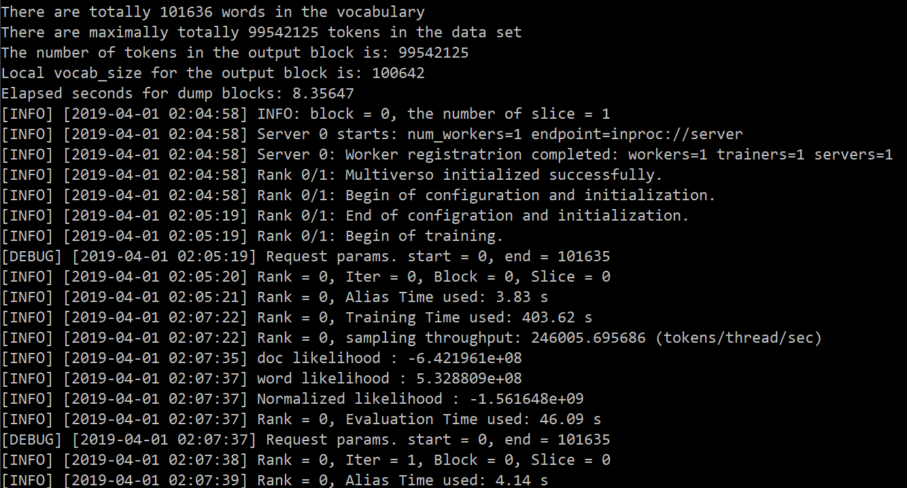
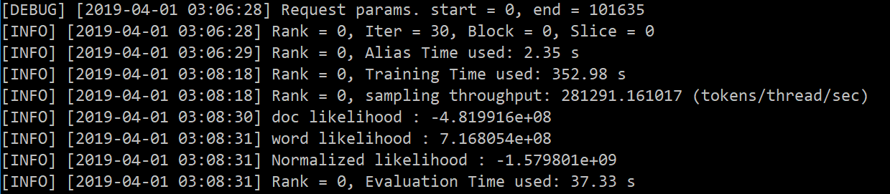

# LightLDA配置文档

## 一、配置机器介绍

操作系统：Ubuntu 18.04.2 LTS 64位

gcc版本：gcc (Ubuntu 7.3.0-27ubuntu1~18.04) 7.3.0

python版本：Python 2.7.15rc1

##  二、依赖工具安装

安装之前需要先安装版本控制工具`git`：

```sh
sudo apt update && sudo apt install git
```

##  三、LightLDA安装

从github上下载lightLDA的源代码到本地，为了避免配置公钥的麻烦，采用https方式进行clone：

```sh
git clone https://github.com/Microsoft/LightLDA.git
```

clone完成之后进入LightLDA工程目录：

```sh
cd LightLDA/
```

下载LightLDA依赖的DMTK到`multiverso`文件夹下：

```sh
git clone -b multiverso-initial https://github.com/Microsoft/multiverso.git
```

之后需要修改三处文件：

1. 修改`multiverso/third_party/install.sh`文件，将第10行  

   ```sh
   wget http://download.zeromq.org/zeromq-4.1.3.tar.gz
   ```

   替换为

   ```sh
   wget https://github.com/zeromq/zeromq4-1/releases/download/v4.1.3/zeromq-4.1.3.tar.gz
   ```

2. 修改`multiverso/Makefile`文件，在`CXXFLAGS`最后`-fpermissive`选项之后增加`-pthread`选项：

   ```sh
   CXXFLAGS = -O3 \
              -std=c++11 \
              -Wall \
              -Wno-sign-compare \
              -fno-omit-frame-pointer \
              -fpermissive \
              -pthread
   ```

3. 修改当前目录下的`build.sh`文件，注释掉第3行：

   ```sh
   # build lightlda
   
   # git clone -b multiverso-initial git@github.com:Microsoft/multiverso.git
   
   cd multiverso
   cd third_party
   sh install.sh
   cd ..
   make -j4 all
   
   cd ..
   make -j4
   ```

最后执行`sh build.sh`构建LightLDA。

运行完成后，还需要将`libzmq.so.5`文件所在目录加入链接路径中，具体操作：

1. 编辑 `/etc` 目录下的`ld.so.conf`文件（`sudo vim /etc/ld.so.conf`），在文件中加入`libzmq.so.5`文件的路径：`/home/psworker/LightLDA/multiverso/third_party/lib`

   （此处必须添加绝对路径）

2. 执行`sudo ldconfig`命令

至此LightLDA安装完成。

## 四、安装时遇到的问题

下载lightLDA源代码之后直接运行`build.sh`脚本进行构建可能会遇到以下错误：

### 1. 无法将multiverso包clone到本地

```
Cloning into 'multiverso'...
The authenticity of host 'github.com (192.30.253.112)' can't be established.
RSA key fingerprint is SHA256:nThbg6kXUpJWGl7E1IGOCspRomTxdCARLviKw6E5SY8.
Are you sure you want to continue connecting (yes/no)? yes
Warning: Permanently added 'github.com,192.30.253.112' (RSA) to the list of known hosts.
Permission denied (publickey).
fatal: Could not read from remote repository.

Please make sure you have the correct access rights
and the repository exists.
```

原因是因为没有在github上配置公钥，可通过将本地公钥加入github或将`build.sh`文件第3行修改为 

```sh
git clone -b multiverso-initial https://github.com/Microsoft/multiverso.git
```

### 2. 无法下载`zeromq-4.1.3.tar.gz`文件

```
--2019-03-31 17:18:58--  http://download.zeromq.org/zeromq-4.1.3.tar.gz
Resolving download.zeromq.org (download.zeromq.org)... 34.251.3.3, 54.76.26.146, 52.31.22.29, ...
Connecting to download.zeromq.org (download.zeromq.org)|34.251.3.3|:80... failed: Resource temporarily unavailable.
Connecting to download.zeromq.org (download.zeromq.org)|54.76.26.146|:80... connected.
HTTP request sent, awaiting response... 301 Moved Permanently
Location: https://archive.org/download/zeromq_4.1.3/zeromq-4.1.3.tar.gz [following]
--2019-03-31 17:19:21--  https://archive.org/download/zeromq_4.1.3/zeromq-4.1.3.tar.gz
Resolving archive.org (archive.org)... 59.24.3.173
Connecting to archive.org (archive.org)|59.24.3.173|:443... failed: Resource temporarily unavailable.
Retrying.
.....
```

需要将`multiverso/third_party`目录下的`install.sh`文件第10行`zeromq-4.1.3.tar.gz`的下载链接替换为

```sh
wget https://github.com/zeromq/zeromq4-1/releases/download/v4.1.3/zeromq-4.1.3.tar.gz
```

### 3. 在`multiverso`目录下执行`make -j4 all`时编译失败：

```
/usr/bin/ld: /home/ubuntu/LightLDA/multiverso/lib/libmultiverso.a(server.o): undefined reference to symbol 'pthread_create@@GLIBC_2.2.5'
//lib/x86_64-linux-gnu/libpthread.so.0: error adding symbols: DSO missing from command line
collect2: error: ld returned 1 exit status
Makefile:55: recipe for target '/home/ubuntu/LightLDA/multiverso/bin/multiverso_server' failed
make: *** [/home/ubuntu/LightLDA/multiverso/bin/multiverso_server] Error 1
```

需要修改`multiverso`目录下的`Makefile`文件，在`CXXFLAGS`最后`-fpermissive`选项之后增加`-pthread`选项。pthread是 POSIX 的 thread 库， 各种 Unix 系统中的多线程多是基于它的，最新版本的gcc编译pthread代码需要添加`-pthread`这个参数。

## 五、运行sample

进入`example`目录并执行`nytimes.sh`文件（必须先进入`example`目录，否则执行`nytimes.sh`文件时可能会找不到`text2libsvm.py`文件）：

```sh
cd example && sh nytimes.sh
```

`nytimes.sh`文件内容如下

```sh
#!/bin/bash

root=`pwd`
echo $root
bin=$root/../bin
dir=$root/data/nytimes

mkdir -p $dir
cd $dir

# 1. Download the data
wget https://archive.ics.uci.edu/ml/machine-learning-databases/bag-of-words/docword.nytimes.txt.gz
gunzip $dir/docword.nytimes.txt.gz
wget https://archive.ics.uci.edu/ml/machine-learning-databases/bag-of-words/vocab.nytimes.txt

# 2. UCI format to libsvm format
python $root/text2libsvm.py $dir/docword.nytimes.txt $dir/vocab.nytimes.txt $dir/nytimes.libsvm $dir/nytimes.word_id.dict

# 3. libsvm format to binary format
$bin/dump_binary $dir/nytimes.libsvm $dir/nytimes.word_id.dict $dir 0

# 4. Run LightLDA
$bin/lightlda -num_vocabs 111400 -num_topics 1000 -num_iterations 100 -alpha 0.1 -beta 0.01 -mh_steps 2 -num_local_workers 1 -num_blocks 1 -max_num_document 300000 -input_dir $dir -data_capacity 800
```

因为脚本中给出的数据集链接下载太慢，需要换数据源，[此网站](https://bigartm.readthedocs.io/en/v0.8.2/download.html)上有相同的数据集，可以用下面的链接替换`nytimes.sh`文件中的链接：

```sh
# 1. Download the data
wget https://s3-eu-west-1.amazonaws.com/artm/docword.nytimes.txt.gz
gunzip $dir/docword.nytimes.txt.gz
wget https://s3-eu-west-1.amazonaws.com/artm/vocab.nytimes.txt
```

运行时出现以下错误需要在`/etc/ld.so.conf`文件中加入`libzmq.so.5`文件的路径（`/home/psworker/LightLDA/multiverso/third_party/lib`）

```sh
/home/psworker/LightLDA/example/../bin/lightlda: error while loading shared libraries: libzmq.so.5: cannot open shared object file: No such file or directory
```

### 运行结果

首次迭代：



第30次迭代：



随着迭代次数增加，每轮迭代需要的时间越来越少。

## 六、并行执行

在`~/.bashrc`文件中添加一下内容：

```sh
export PATH=~/LightLDAtest/bin:~/LightLDAtest/multiverso/third_party/bin:$PATH
export LD_LIBRARY_PATH=~/LightLDAtest/multiverso/third_party/lib:$LD_LIBARY_PATH
```

然后使更改生效：

```sh
source ~/.bashrc
```

在数据集所在目录新建chunk.py文件并填入以下内容：

```python
'''
split a file into a given number of chunks randomly, line by line.
Usage: chunk.py <input file> <number of chunks> [<seed>]'
'''

import sys, random, os

input_file = sys.argv[1]
num_chunks = int( sys.argv[2] )

try:
        seed = sys.argv[3]
except IndexError:
        seed = None

if seed:
        print "seeding: %s" % ( seed )
        random.seed( seed )

basename = os.path.basename( input_file )
basename, ext = os.path.splitext( basename )

i = open( input_file )

os = {}
for n in range( num_chunks ):
        output_file = "%s_%s%s" % ( basename, n, ext )
        os[n] = open( output_file, 'wb' )

counter = 0

for line in i:
        n = random.randint( 0, num_chunks - 1 )
        os[n].write( line )

        counter += 1
        if counter % 100000 == 0:
                print counter

```

然后运行 `python chunk.py nytimes.libsvm 3`将数据集文件分为3部分。

然后依次执行以下命令：

```sh
dump_binary nytimes_0.libsvm nytimes.word_id.dict . 0
dump_binary nytimes_1.libsvm nytimes.word_id.dict . 1
dump_binary nytimes_2.libsvm nytimes.word_id.dict . 2
```

将生成的 `block.1 vocab.1 vocab.1.txt` 和  `block.2 vocab.2 vocab.2.txt` 放到另一台服务器上的对应位置。编号都改为0。

新建`host.txt`文件并将填入所有服务器的内网ip，如：

```
172.17.89.222
172.17.89.230
172.17.89.221 
```

最后在`example`目录下执行以下命令：

```sh
# Run LightLDA
mpiexec -machinefile host.txt ../bin/lightlda -num_vocabs 111400 -num_topics 1000 -num_iterations 100 -alpha 0.1 -beta 0.01 -mh_steps 2 -num_local_workers 1 -num_blocks 1 -max_num_document 300000 -input_dir ./data/nytimes -data_capacity 800
```

执行之需要确保主机与其他机器之间可以ssh免密登录。